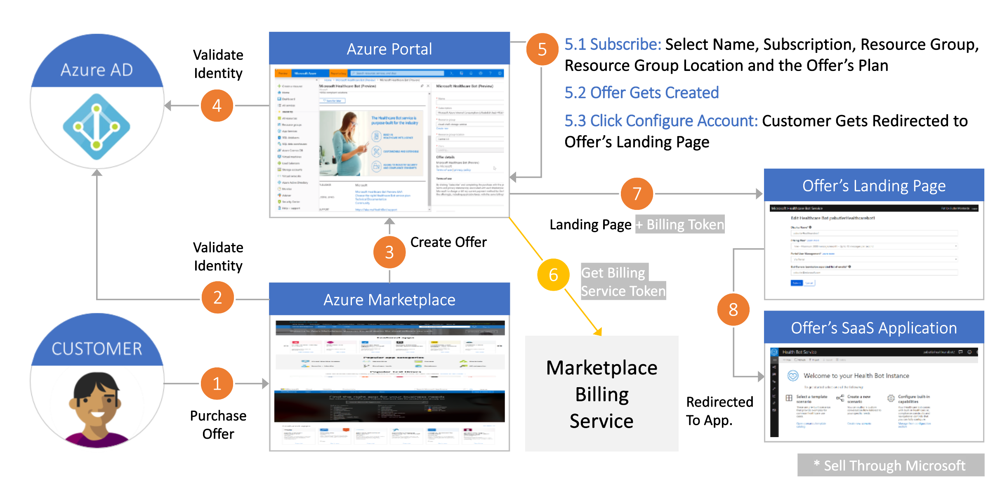
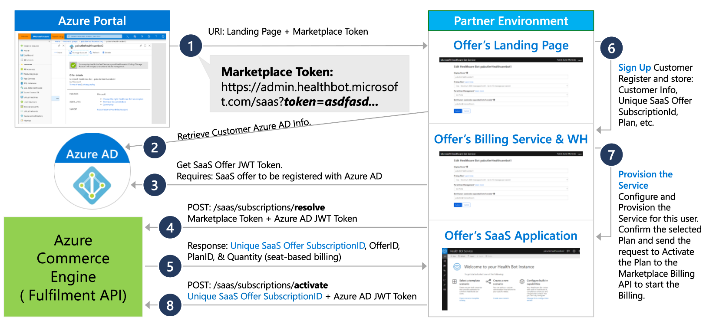
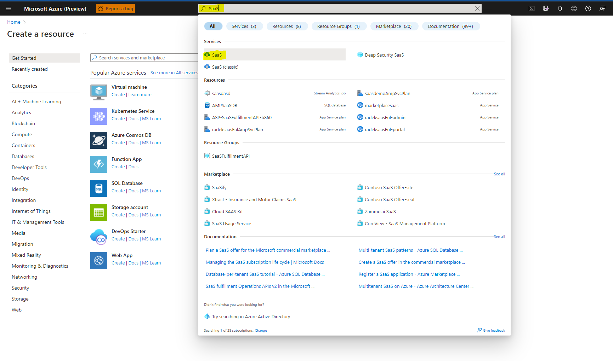

#Challenge 1: Customer Flow

## Introduction
On this challange you will put customer shoes and you will understand what customer need to do to purchase the product via Azure Marketplace. 
As well you will familiar with SaaS Fulfillment API wich is main point for communication with Azure Marketplace.

## Description
You need to go to azuremarketplace.com and subscribe one of the offer. You need to select one of the free offer as you are using sponsorship subscription. You cannot pay for partner product using Azure Credists. 
We reccomend to use one of our partners offers which are already published:
E.g. [Atlas MongoDB](https://azuremarketplace.microsoft.com/en-us/marketplace/apps/mongodb.mdb_atlas_oct2020?tab=PlansAndPrice) or [Twillo SendGrid](https://azuremarketplace.microsoft.com/en-us/marketplace/apps/sendgrid.tsg-saas-offer?tab=Overview)

### The Landing Page authentication workflows
Lets analyse whad happend durring your purchase.

1. Customer found product on Azure Portal, Azure Marketplace or got direct ling from someone and click "Get it now"
2. They walidated via Azure Active Directory, the same account thet is used to access current Azure services.
3. Customer is redirected to page for subscription enablement
4. Idenity of a purchaser is validated and confirming  that this customer has right to purchase your offer
5. Customer providing basic information about subscription and confirming selected pricing plan and click subscribe
6. Azure create product subscription and attach this position to customer inoice but billing is not active yet
7. Customer is redirected to your landing page where you can collect or required data for accaunt activation
8. Cusdtomer might be redirected by you to product or instructed about further steps. You need to remember that you need to activate billing withing 30days using API.  30 days grace period is for you to finish configuration and expose solution to customer

If something will go wrong with customer configuration or customer will drop subscription configuration in the middle of steps please remember that you have those data in [***Azure Storage Leads Table***](https://docs.microsoft.com/en-us/azure/marketplace/partner-center-portal/commercial-marketplace-lead-management-instructions-azure-table) and you can constact with customer and help with finishing the process.

### Landing Page

The landing page's role starts when a new user comes to it and is logged in via **Azure Active Directory (AAD)**. If needed, the landing page can collect more information about the user or parameters of the product.

Optionally there are a few things one might consider including on a landing page, such as:
- Let customers know next steps 
- Collect information from the customer (like company name, phone number, other info)
- Send email confirmation to customer
- Send email to operations team about new customer
- Automatically provision the customer's account

Landing page is just a ***page hosted by the publisher***. In this hackathon we will be using Landing page implemented in aka.ms/SaaSAccelerator repository.

### SaaS Offer Purchase Flow in Depth

Let's drill down into the  flow of a customer buying a publisher's subscription.

1. After customer click "Get it now" and subscription was attached to an account customer is redirected to landing page. To the URL Marketplace attach query parameter called "Token". Token allow you to know what kind of subscription customer purchased. If the token is on place you are sure that this page visit is the new customer.
2. To understand what information you can get from token you need to validate your app identity via AAD using Service Principal and secret
3. You can provide signing to your landing page via AAD for your customers - this implementation you will be testing on hackathon in further steps.
4. When you received JWT token from AAD you can use it together with Token from URL to get info about subscription by doing POST on /resolve API endpoint
5. As a response you will get JSON object containing information which offer customer selected and what are customers data
6. You can combine information from subscription JSON object with user account to display for user status of their subscription
7. Now you need finish configuration of customer product. It can be done by auto provisioning but many B2B product require consultancy with customer before. Yopu have 30 days to finish this activity
8. When customer can use product you need to activate subscription via /activate endpoint and this is the time from when Azure starts charging your customer

### Where to find subscribed product in Azure Portal?

In top search provide saas and select first option. You will be redirected to all SaaS subscriptions associated with your account.

## Success Criteria
1. Show in Azure Portal that offer was subscriped and it is in pending state.
2. Answer questions:
- Why offer is in pending state instead activated?
- When customer will start be charging on purchase date or on activation date?
- Who hosting page that customer is redirected - Azure Marketplace or partner on it's own subscription?
- How partner knows that customer purchase solution?
- Why AAD is mandatory for landing page? 
- What is max number of the days between Subscription and Activation?
- Why you need to call resolve token endpoint in landing page and what information it gives you?
- What endpoint need to be called to activate subscription? 
- Which field from JSON object received after calling Resolve token endpoint give you contact email to customer?
3. Describe client subscription lifecycle and retention 

## Learning Resources
[SaaS Fulfillment API](https://docs.microsoft.com/en-us/azure/marketplace/partner-center-portal/pc-saas-fulfillment-apis)

[Marketplace leads](https://docs.microsoft.com/en-us/azure/marketplace/partner-center-portal/commercial-marketplace-lead-management-instructions-azure-table)

[Resolve Token](https://docs.microsoft.com/en-us/azure/marketplace/partner-center-portal/pc-saas-fulfillment-subscription-api#resolve-a-purchased-subscription)
