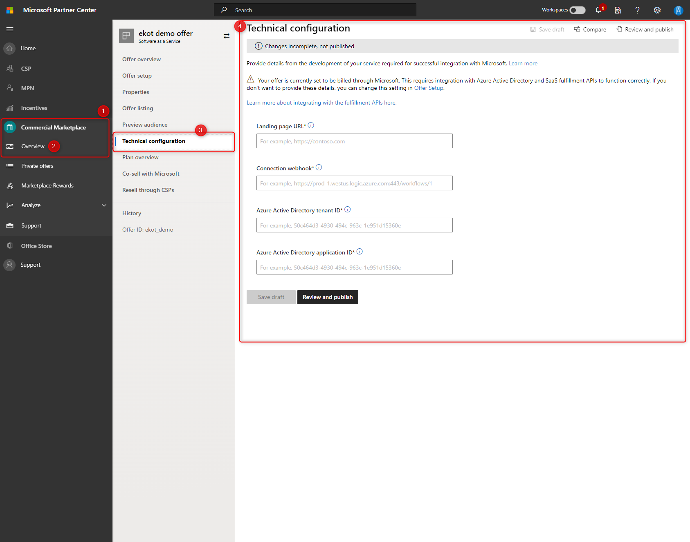

#Challenge 3: Partner Center configuration

## Introduction
This challange allow you to understand technical requirements of the integration and review the information that need to be provided in partner center to publish transactable offer. 

## Description

Go to: **Microsoft Partner Center** > **Commercial Marketplace** > **Overview** > **Technical configuration** and let's check some details.

On the **Technical configuration** tab, you'll define the technical details that the commercial marketplace uses to communicate to your SaaS application or solution.

You have to provide:

1. **Landing page URL (required)** - The SaaS URL that a user will be directed to for setup. This URL will receive a token that can be used to call the fulfilment APIs to get provisioning details for your interactive registration page.  
Provide URL of the page which implement resolve token SaaS Fulfillment API **from deployed accelerator** - find page which implements resolve token.

   > Your landing page should be up and running 24/7. This is the only way you will be notified about new purchases of your SaaS offers made in the commercial marketplace, or configuration requests of an active subscription of an offer. Don't include the pound sign character (#) in the landing page URL. Otherwise, customers will not be able to access your landing page.

2. **Connection webhook (required)** - For all asynchronous events that Microsoft needs to send to you (for example, SaaS subscription has been cancelled), we require you to [provide a connection webhook URL](https://docs.microsoft.com/en-us/Azure/marketplace/partner-center-portal/pc-saas-fulfillment-webhook). We will call this URL to notify you of the event.

   > Your webhook should be up and running 24/7 as this is the only way you will be notified about updates about your customers' SaaS subscriptions that are purchased via the commercial marketplace.  
   Provide ULR based on [Controller definition](https://github.com/Azure/Commercial-Marketplace-SaaS-Accelerator/blob/main/src/SaaS.SDK.CustomerProvisioning/Controllers/WebHook/AzureWebhookController.cs)

3. **Azure Active Directory tenant ID (required)** review challange 02-01 - to find the tenant ID for your Azure Active Directory (Azure AD) app, go to the [App registrations](https://portal.Azure.com/#blade/Microsoft_AAD_RegisteredApps/ApplicationsListBlade) blade in Azure Active Directory. In the **Display name** column, select the app. Then look for the **Directory (tenant) ID** number listed. An example: `50c464d3-4930-494c-963c-1e951d15360e`

4. **Azure Active Directory application ID (required)** review challange 02-01 - To find your [application ID](https://docs.microsoft.com/en-us/Azure/active-directory/develop/howto-create-service-principal-portal#get-tenant-and-app-id-values-for-signing-in), go to the [App registrations](https://portal.Azure.com/#blade/Microsoft_AAD_RegisteredApps/ApplicationsListBlade) blade in Azure Active Directory. In the **Display name** column, select the app. Then look for the Application (client) ID number listed. An example: `50c464d3-4930-494c-963c-1e951d15360e`

5. **Configure Azure Table for leads to make sure that you will catched all atempts of subscription when it failed or customer dropped the process**
Follow the [instruction](https://docs.microsoft.com/en-us/azure/marketplace/partner-center-portal/commercial-marketplace-lead-management-instructions-azure-table)

6. **Provide plan with priocing and 3. dimensions** - thanks to Metered API you will be able to charge customer dinamically based on service consumption. You will learn details tin challenge 5.
Bellow you see pricing in $ as an example how it can looks like on production but **for testing please set $0**. 

- Dimension as metric of number of API Call e.g. 100 events costs 3$
- Dimension for man-hours e.g. 1h cost 60$
- Dimension for undefined activities e.g. 1 event cost 1$

7. Click "Review and Publish". Validation process should take few hours you can check the status at the beggining of day 2. Meanwhile you can start working on next challenge.

## Success Criteria
1. Offer can be subscribed and customer is redirected into provided landing page.
- What do you see customer portal after you subscribed your offer?
- What do you see in admin portal after you subscribed your offer?

2. Review records in Azure Table after subscription
- What information you can retreive from the table?

3. Review ResolveToken [implementation](https://github.com/Azure/Commercial-Marketplace-SaaS-Accelerator/blob/main/src/SaaS.SDK.CustomerProvisioning/Controllers/HomeController.cs) and describe what data request returns
- Which page implements resolve token Api endpoint? 
- What information it contains and what you can get resolving the token?

4. Offer contain plan with 3 demensions

5. Anwer questions: 
- What is the difference between Subscription object and Operation in SaaS Fulfillment API?
- When partner knows that customer triggered some activity and operation object was created?
- How to test webhook?

## Learning Resources

[SaaS Fulfillment API - Operations](https://docs.microsoft.com/en-us/azure/marketplace/partner-center-portal/pc-saas-fulfillment-operations-api)

[SaaS Fulfillment API - Subscriptions](https://docs.microsoft.com/en-us/azure/marketplace/partner-center-portal/pc-saas-fulfillment-subscription-api)

[Implement webhook](https://docs.microsoft.com/en-us/azure/marketplace/partner-center-portal/pc-saas-fulfillment-webhook)