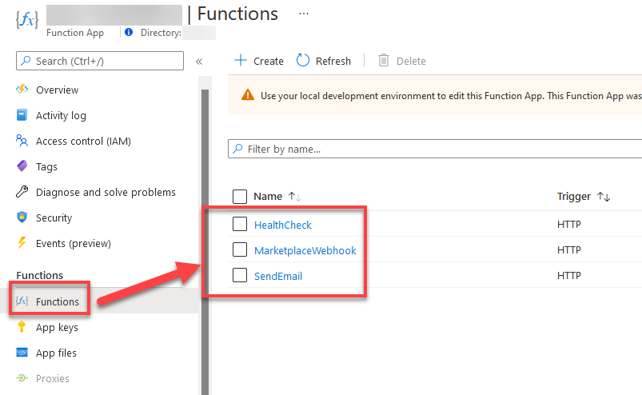

## Challenge 4: Implement WebHook

In this challenge you will dive deeper in webhook implementation. You will deploy separate project to demonstrate how webhook can be implemented outside of demo project. 

### Pre-requisites

To be able to run the solution you will need to have [.NET Core 6](https://dot.net) installed and appropriate local development environments setup. More [here](https://docs.microsoft.com/en-us/azure/azure-functions/functions-develop-local). 
[Visual Studio](https://visualstudio.com) is _optional_, but recommended. 

If you are on Windows, [Powershell](https://docs.microsoft.com/en-us/powershell/scripting/install/installing-powershell?view=powershell-7.2) is already installed. You can follow along as well in other platforms, but you will need to have [PowerShell](https://docs.microsoft.com/en-us/powershell/scripting/install/installing-powershell?view=powershell-7.2) installed to use below instructions. 

### What is the WebHook and what we can and should implement there

The webhook is where Microsoft will inform you about changes — when you’ll have to reconfigure your user’s account on plan changes, to disable it when the subscription ends, or payment fails. WebHook is working on your side and you as a publisher provide the URL for this webhook endpoint when registering the offer for Azure Marketplace.

It has to be available 24/7, and Microsoft will keep trying to call it until you return 200. Webhook is a mechanism to drive the actual SaaS subscription activation, usage, updates, and cancellation so it needs to work seamleassly.

The list of operations that are placed there include:
When the SaaS subscription is in Subscribed status:
ChangePlan
ChangeQuantity
Suspend
Unsubscribe

When SaaS subscription is in Suspended status:
Reinstate
Unsubscribe

Change plan, change quantity, and unsubscribe actions are tested from the publisher side. From the Microsoft side, unsubscribe can be triggered from both the Azure portal and Admin Center (the portal where Microsoft AppSource purchases are managed). Change quantity and plan can be triggered only from Admin Center.

### WebHook Sample Implementation and Workflow

To demonstrate that functionality, you will deploy an Azure function to work as webhook. You can check the code [here](https://github.com/vrhovnik/azure-demo-saas-marketplace-webhook) and clone it to you directory of choice like this: 

```
git clone https://github.com/vrhovnik/azure-demo-saas-marketplace-webhook.git
```

If you don't have [git](https://git-scm.com/downloads) installed, you can download it as zip (check below picture). If you did download it as zip, extract the content in the folder.


If that is not an option, download zip file [here](./Extras/SaasFunctions.zip).

Navigate to the folder. Copy the folder path:


_p.s._
If you are in an editor, you can rebuild the project to get the latest binaries prepared and skip below steps.

Open the folder in Powershell (or command line). and do dotnet build:

```
dotnet build
```


If build is successful, let's deploy the solution to the Azure.

Navigate to the [Azure Portal](https://portal.azure.com). Create new Azure Function. 


Select resource group (where your app is located) and choose Publish method to be **Code** and Runtime stack **.NET** with version **6**. Select region based on your app the resource group.


Pick storage account which you used for leads generation and select **Windows** as Operating System (you can select Linux as well, if you want to test that functionality). Make sure **Consumption** is selected as Plan type.


Proceed to review and create, revisit summary and confirm the creation. Wait for Azure Function to be deployed.

Navigate to storage account. Webhook will write to Azure Table to demonstrate logs.


Click Add table and put in the name **webhooklogs**.


Confirm and proceed to Access keys section in the menu on the left and copy connection string.


Navigate to the newly created Azure Function configuration page and add that connection string.


Save and we are ready to deploy the application to Azure.

_p.s._
Below are instructions for PowerShell, but you can use tools which suits you better. Deployment options available [here](https://docs.microsoft.com/en-us/azure/azure-functions/functions-deployment-technologies).

### Powershell instructions

Go to the (cd [directory]) to the **SaasFunctions\SaasFunctions** directory.

```
\SaasFunctions\SaasFunctions\
```

Execute this command.

```powershell
dotnet publish .\SaasFunctions.csproj -c debug -o Webhook
```

Execute this command.

```powershell
Compress-Archive -Path .\Webhook\* -DestinationPath Webhook.zip -Force
```

This will prepare our project to be deployed.

Go to Kudu website. Change the "link" to the value of your website, DO NOT CHANGE anything else.

```
https://yourwebsite.scm.azurewebsites.net/ZipDeployUI
```

Drag and drop the **Webhook.zip** to the UI with the directory listing. This will cause the upload and deployment.

Navigate to Azure Function and select Functions in the menu. You should see this:



Go into MarketplaceWebhook and select Monitor (if you don't see anything, enable monitoring support in Azure Functions - more here):


Select **logs tab** to check data in realtime and open new tab in browser. Navigate to the consumer apps landing page and subscribe to the offer, activate it using your Admin portal and cancel the subscription from the portal. You should see notification coming to your webhook with details.

Navigate back to Azure Functions logs tab to see the results.

**Before you start testing webhook please copy MarketplaceWebhook Function URL, paste it in Partner Center as Webhook and republish an offer**

You can use [this postman collection](./Extras/SaaS-Hackathon-Webhooks.json) to be able to modify requests and play around with webhook to validate the right usage.

## Success Criteria

1. You will receive notification in Azure Table when customer change plan. Implementing SendGrid and Email notification function is extra challange which you can come back after finishing challange 5. 
2. You will answer questions:
- What statuses operation object can get and when they are triggered?
- Does Azure Marketplace store history of changes?

## Additional resources

- https://docs.microsoft.com/en-us/azure/marketplace/partner-center-portal/pc-saas-fulfillment-webhook
- https://docs.microsoft.com/en-us/azure/logic-apps/logic-apps-custom-api-authentication
