# Challenge 5: Use of Metered API

## Introduction

With the commercial marketplace metering service, you can create software as a service (SaaS) offers that are charged according to non-standard units. Before publishing a SaaS offer to the commercial marketplace, you define the billing dimensions such as bandwidth, tickets, or emails processed. Customers then pay according to their consumption of these dimensions, with your system informing Microsoft via the commercial marketplace metering service API of billable events as they occur.

## Pre-requisites 

For a SaaS offer to use metered billing, it must first:

1. Meet all the offer requirements for a sell through Microsoft offer as outlined in [Create a SaaS offer](https://docs.microsoft.com/en-us/azure/marketplace/create-new-saas-offer?tabs=workspaces-view) in the commercial marketplace.
2. Integrate with the [SaaS Fulfillment APIs](https://docs.microsoft.com/en-us/azure/marketplace/partner-center-portal/pc-saas-fulfillment-apis) for customers to provision and connect to your offer.
3. Be configured for the flat rate pricing model when charging customers for your service. Dimensions are an *optional* extension to the flat rate pricing model. For development purposes we use 0$ as base price to simplify development/testing (for production this value is different)
4. In order to continue with the task, you will need to have [SaaS Accelerator](02-00-Deploy-SaaS-Accelerator%20-%20Day%201.md) deployed and [metered dimensions](./03-Partner_Center_configuration%20-%20Day%201.md) configured.
5. [Dotnet 3.1 installed](https://dot.net) with development editor of your choice ([Visual Studio Code](https://code.visualstudio.com), [Visual Studio](https://visualstudio.microsoft.com/), [Rider](https://www.jetbrains.com/rider/),...) for building custom form for API submissions.
6. Access to test/dev subscription to be able to configure and copy values to access API and Azure from local machine.

## Add code to call record man-hours on the project

We will add custom form to add custom metered API call on specific subscription. Check Metered API implementation in [SaaS.SDK.Provisioning.Services](https://github.com/Azure/Commercial-Marketplace-SaaS-Accelerator/blob/main/src/SaaS.SDK.Services/Services/MeteredBillingAPIService.cs).

In my example, I have custom dimension for **Custom email sent** with ID **2c3cd506-73f3-49e5-9d6f-a13a9b78eea0** on plan **cee-free-plan**.

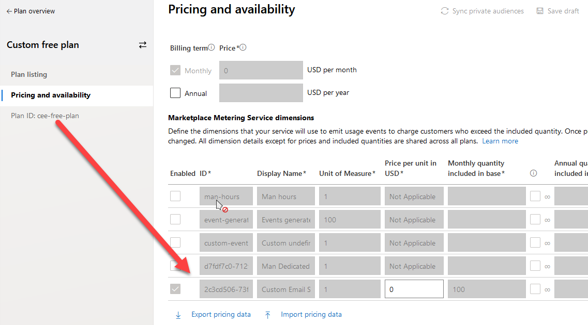

Go to **SaaS.SDK.PublisherSolution**, open **HomeController** in folder **Controllers**. Add below code after **Index()** method.
```c#
public IActionResult EmitUsage(Guid subscriptionId, string planId)
{
   logger.LogInformation($"Home Controller / EmitUsage with subscription id {subscriptionId} with plan id {planId}");

   var allDimensionsList = dimensionsRepository.GetDimensionsByPlanId(planId);

   var dimension = allDimensionsList.FirstOrDefault();

   ViewBag.DimensionDescription = dimension.Description;

   var model = new MeteringUsageRequest
   {
       EffectiveStartTime = DateTime.UtcNow,
       PlanId = planId,
       Quantity = 0,
       Dimension = dimension.Dimension,
       ResourceId = subscriptionId
   };

   return View(model);
 }
```

Right click on **View(Model)** and select **Add view** option.

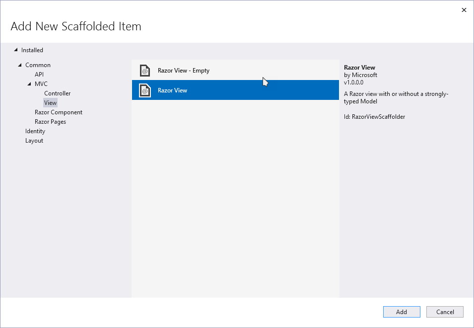

Choose **Razor view empty**. Copy below code into file (before copy press CTRL+A to select all items and delete everything before pasting code). Choose name **EmitUsage.cshtml** (the same as method name in controller):
```c#
@using Microsoft.Marketplace.SaaS.SDK.Services.Models;
@model MeteringUsageRequest

@{
string title = $"Emit usage for plan {Model.PlanId} with dimension {ViewBag.DimensionDescription}";
ViewData["Title"] = title;
}
<div>
    <div class="container">
        <br />
        @if (TempData["Message"] != null)
        {
            <div class="alert alert-danger">
                <strong>Information:</strong> @TempData["Message"]
            </div>
        }
        <div class="card-body ">
            <br />
            <div class="form-group row">
                <div class="col-md-12">
                    <div class="text-left">
                        <span class="cm-section-heading">@title</span>
                    </div>
                    <form  method="post">
                        <div class="row p10">
                            @Html.HiddenFor(s => s.ResourceId)
                            @Html.HiddenFor(s => s.PlanId)
                            @Html.HiddenFor(s => s.Dimension)
                            <div class="col-md-1 pt-1">
                                @Html.LabelFor(s => s.Quantity, new { @class = "font-weight-bold" })
                            </div>
                            <div class="col-md-2">
                                @Html.TextBoxFor(s => s.Quantity, null, new { @class = "form-control", @placeholder = "Quantity", required = "required" })
                            </div>
                            <div class="col-md-1 pt-1">
                                @Html.LabelFor(s => s.Dimension, "Dimension", new { @class = "font-weight-bold" })
                            </div>
                            <div class="col-md-3">
                                @Model.Dimension
                            </div>
                            <div class="col-md-2">
                                <button type="submit" class="cm-button-default mt0">Record Usage</button>
                            </div>
                        </div>
                    </form>
                </div>
            </div>
        </div>
    </div>
</div>
```

Now we need to add code for posting the metered API. Go back to **HomeController** and add below code under **EmitUsage** function:

```c#
public async Task<IActionResult> EmitUsageAsync(MeteringUsageRequest meteringRequest)
{
   try
   {
      meteringRequest.EffectiveStartTime = DateTime.UtcNow;
      logger.LogInformation($"Creating metered request usage for subscription {meteringRequest.ResourceId} on plan {meteringRequest.PlanId} for dimension {meteringRequest.Dimension}");
      var result = await billingApiService.EmitUsageEventAsync(meteringRequest)
                     .ConfigureAwait(false);
      
      var requestJson = JsonSerializer.Serialize(meteringRequest);
      var responseJson = string.Empty;      
      
      logger.LogInformation("EmitUsageEventAsync");
      responseJson = JsonSerializer.Serialize(result);
      logger.LogInformation(responseJson);
            
      // record activity inside database with call to subscription usage
      var subscriptionDetail = subscriptionRepo.GetById(meteringRequest.ResourceId);
      var currentUserId = userService.GetUserIdFromEmailAddress(CurrentUserEmailAddress);
      var newMeteredAuditLog = new MeteredAuditLogs()
      {
         RequestJson = requestJson,
         ResponseJson = responseJson,
         StatusCode = result.Status,
         SubscriptionId = subscriptionDetail.Id,
         SubscriptionUsageDate = DateTime.UtcNow,
         CreatedBy = currentUserId,
         CreatedDate = DateTime.Now
      };
      
      subscriptionUsageLogsRepository.Save(newMeteredAuditLog);      
      TempData["Message"] = $"Status of recording usage is {result.Status}";
   }
   catch (Exception err)
   {
      TempData["Message"] = err.Message;
      logger.LogError(err.Message);
   }
   
   return RedirectToAction(nameof(this.EmitUsage), 
   new { subscriptionId = meteringRequest.ResourceId, planId = meteringRequest.PlanId });
}
```

If you have problems copying from the markdown, the code for copying is available [here](../Coach/SupportFiles/05-Metered-Api-Code), view is available [here](../Coach/SupportFiles/05-Metered-Api-Code).

We need to wire up the items to be called from subscription menu. Navigate to **Views -> Subscriptions.cshtml** in Visual Studio and add folowing code in the menu options below record usage (search for dropdown01).

```c#
<a class="dropdown-item cm-dropdown-option" asp-action="EmitUsage" asp-controller="Home" asp-route-subscriptionId="@Model.Subscriptions[i].Id"
asp-route-planId="@Model.Subscriptions[i].PlanId">Emit usage for custom metered API</a>

```

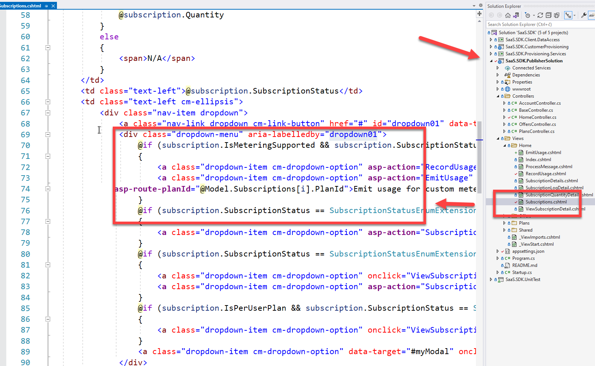

Now you should be ready to put the solution to test.

Press **F5** in Visual Studio. After logging in you should be seeing this:

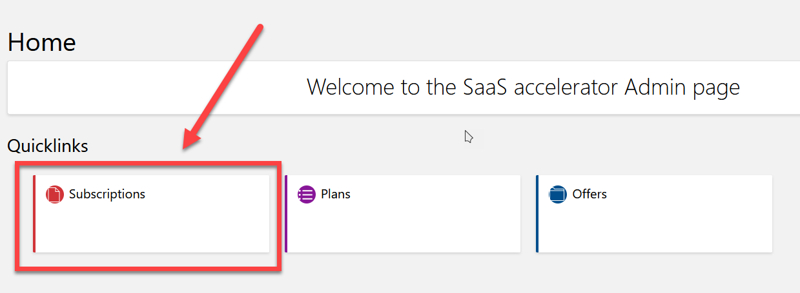

Select **Subscriptions** and your choose active subscription. Choose menu on the side of that subscription (you should see **Emit usage for custom metered API**):

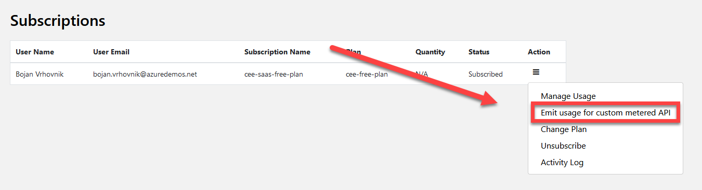

Click link and you should see your custom form. Put in the quantity some value and press button **Record usage**.

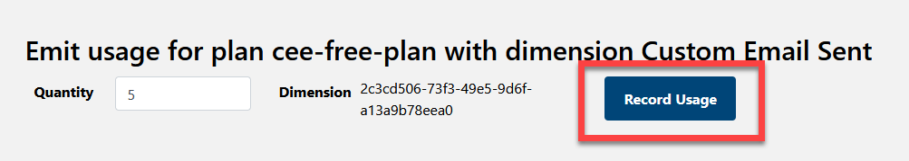

If you are in debug session and you check result returned from metered API call, you should see something similiar as this:

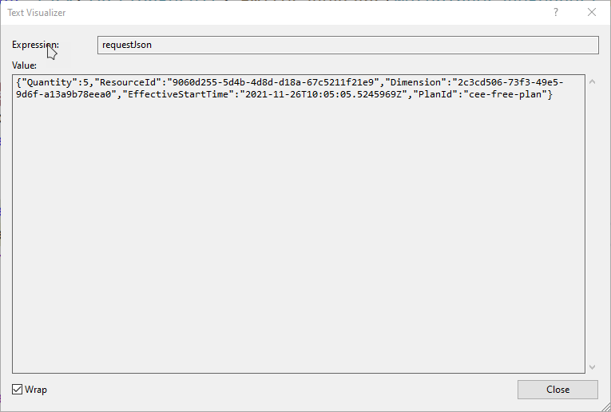

## Deploy to production

As last part we need to push to production. Go to [Azure Portal](https://portal.azure.com) and navigate to SaaS Accelerator admin portal:

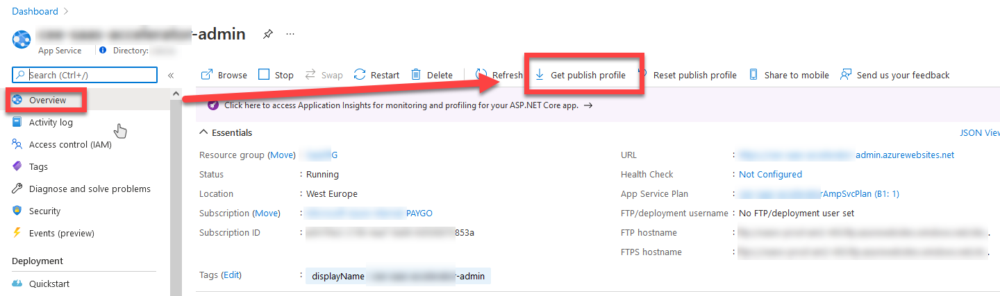

Click download **Get publish profile** button and save profile to local disk.

Go back to Visual Studio, right click on **SaaS.SDK.PublisherSolution** and select **Publish**.

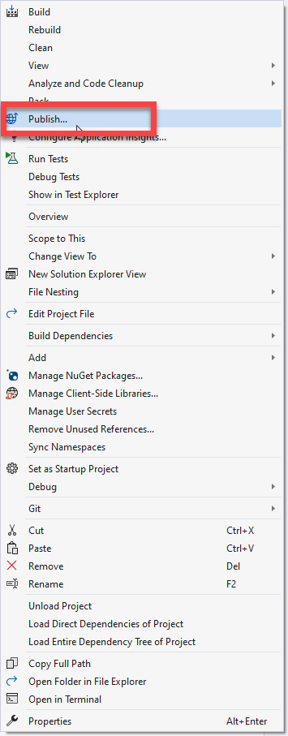

Click **New** and choose **Publish profile**:

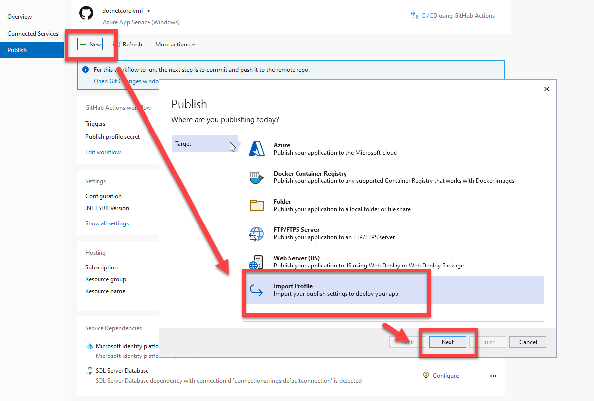

Choose previously downloaded profile and select **Finish**.

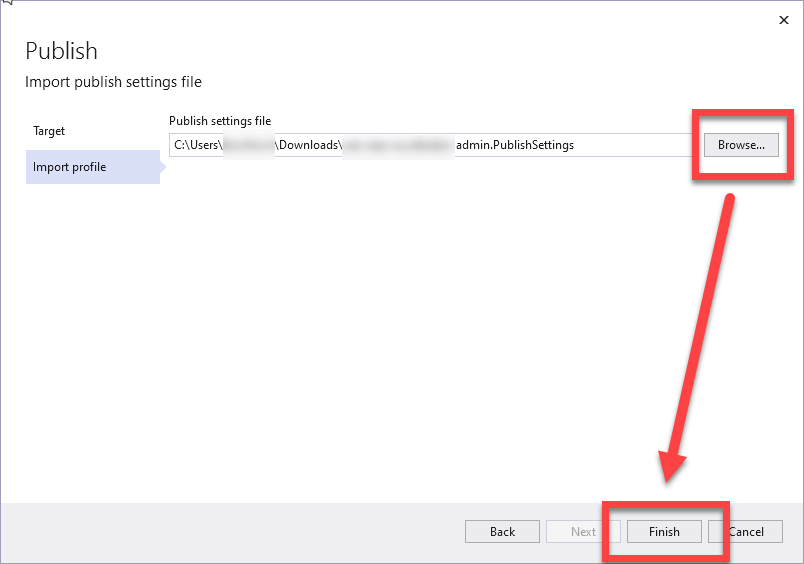

On the Publish profile page select **Publish** and wait for the publish result.

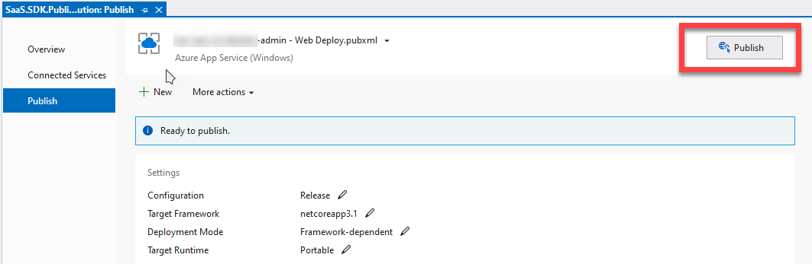

When done, go and check in production, if the changes are there. You should see the same result as on local device.

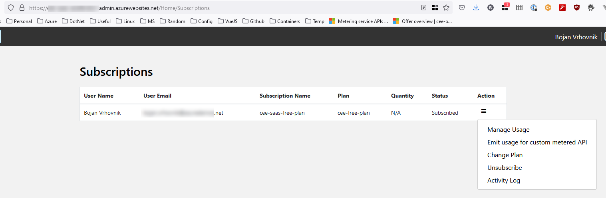

## Success Criteria

Your task is to provide:
1. Successful submission of custom meter from at **least one** of defined categories in [task 3](03-Partner_Center_configuration%20-%20Day%201.md)
   1. Dimension as metric of number of API Call e.g. 100 events costs 0$
   2. Dimension for man-hours e.g. 1h cost 0$
   3. Dimension for undefined activities e.g. 1 event cost 0$

_Hint_: Check [MeteredAPI implementation](https://github.com/Azure/Commercial-Marketplace-SaaS-Accelerator/blob/main/src/SaaS.SDK.Services/Services/MeteredBillingAPIService.cs) inside SaaS Accelerator and how that can be re-used.

2. Meter request should be demonstrated **locally** with one of your preferred options with demonstrated usage
3. *(OPTIONAL)* Store information to the database locally and read that from client app
4. *(OPTIONAL)* Notify customer that he got charged and why using notification mechanisms in SaaS Accelerator
5. New version of publisher app is updated in Azure portal
6. Answer questions (for discussion about what happened and to do simple knowledge check):
- Is Metered API allowed in both Flat Fee pricing and in Per User model?
- Your plan cost $100 you set up dimension where 1 event cost $5 and you set up "Monthly quantity included in base" on 0. What will be finall monthly charge when you send 10 events?
- Your plan cost $100 you set up dimension where 1 event cost $5 and you set up "Monthly quantity included in base" on 7. What will be finall monthly charge when you send 10 events?
- When you would like to use annual pricing on top of monthly one?
- When you would like to force only annual pricing?
- When you would like to use Mix/Max users for "Per User" pricing?
- When you would like to create multiple pricing plans with different markets in each plan?
- What "Select only Microsoft Tax Reminded" option in Markets configuration stands for?
- What information you need to provide if you would like to create private pricing model for customer?

## Learning Resources

1. [Metered billing for SaaS using the commercial marketplace metering service](https://docs.microsoft.com/en-us/azure/marketplace/partner-center-portal/saas-metered-billing)
2. [Marketplace Metered billing APIs](https://docs.microsoft.com/en-us/azure/marketplace/marketplace-metering-service-apis) 
3. [SaaS Accelerator](https://github.com/Azure/Commercial-Marketplace-SaaS-Accelerator)
4. [Learn ASP.NET](https://dotnet.microsoft.com/learn/aspnet)
